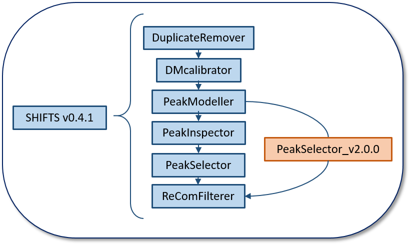

# PeakSelector_v2.0.0

This update allows the user to pass from PeakModeller to ReComFilterer without executing PeakInspector.

### How it works

From the output of PeakModeller, PeakSelector_v2.0.0 divide the range of deltamasses in 1000 zones using an equation given by the user and selects in every zone the deltamass with more slope. Then, from these 1000 deltamass values, PeakSelector_v2.0.0 selects those that represent minimums in the spectrum (one point is a minimum wheter it is between two points with bigger slope than it). Later, outliers are removed by a percentage of 1-tailed confidence interval. Next, with the remaining minimuns, a polynomial of degree 2 is fitted and it is used to separate signal from noise in the original spectrum of deltamasses and select the peaks. 

---

### Files needed

- PeakModeller output
- SHIFTS.ini

The latter file must cointain the following params:

| Param | Explanation | 
|:----------:|:----------:|
| frequency    | Threshold for number of PSMs   | 
| x2    | Quadratic term of the function to calculate the zones to search max slope  | 
| m    | Lineal term of the function to calculate the zones to search max slope   | 
| intercept    | Intercept of the function to calculate the zones to search max slope   | 
| dm0    | Minimum mass of the spectra   | 
| dm1    | Maximum mass of the spectra   | 
| ci_interval    | % of 1-tailed CI for removing outliers (84.13% recommended)   | 

---

### Output

 - Apexlist.txt - List with the selected peaks after filtering
 - DMHistogram_threshold - Histogram of deltamasses referencing the threshold used in each point
 - Fit_plot - The fitting of the minimums represented in a html file
 - DMHistogram_threshold_plot - Plot that represents the DMHistogram_curve 
 - Log file
  

### How to execute

<code>
>>> python PeakSelector_v2.py -i{input file (DMHistogram)} -c{config file}
